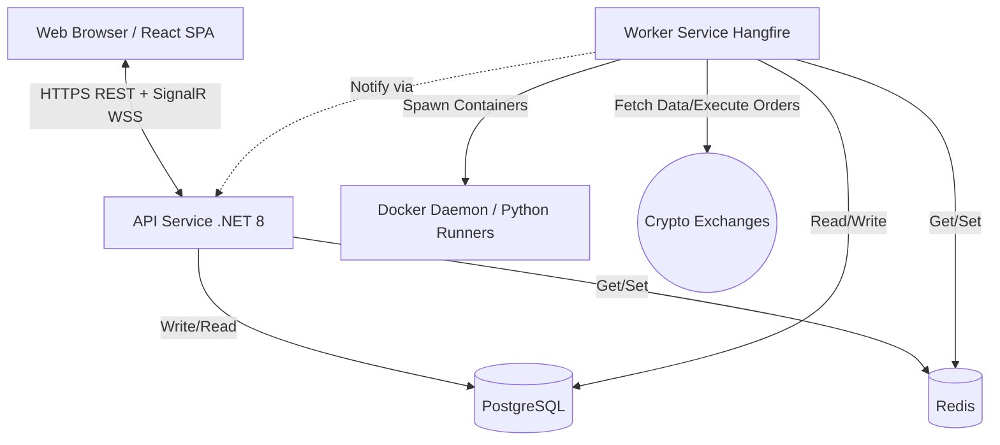
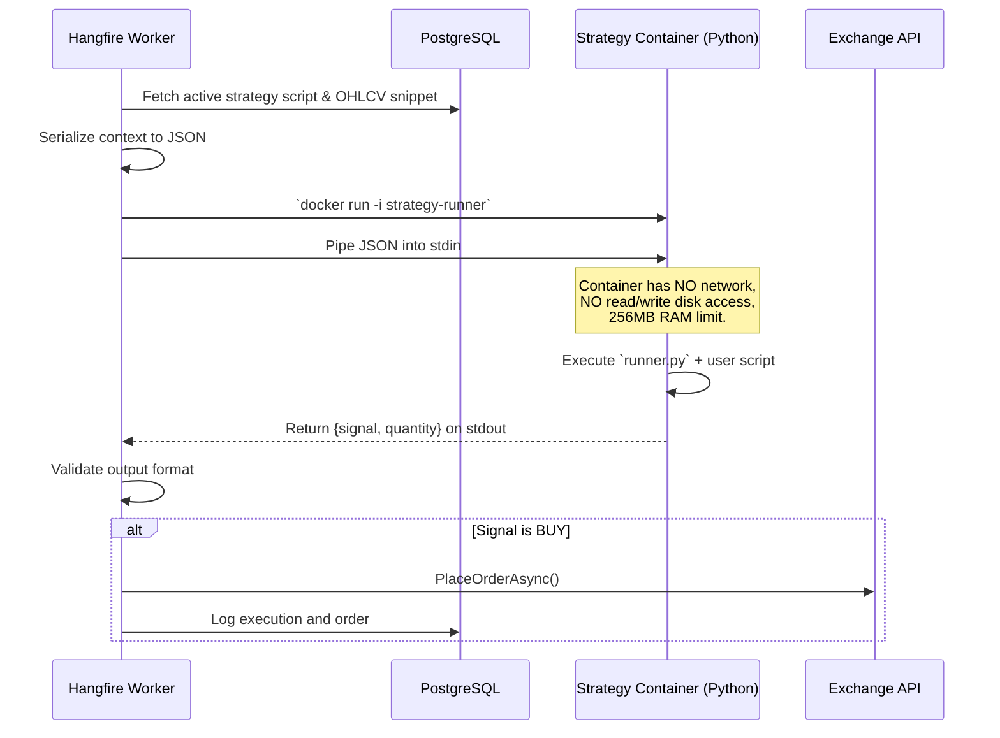
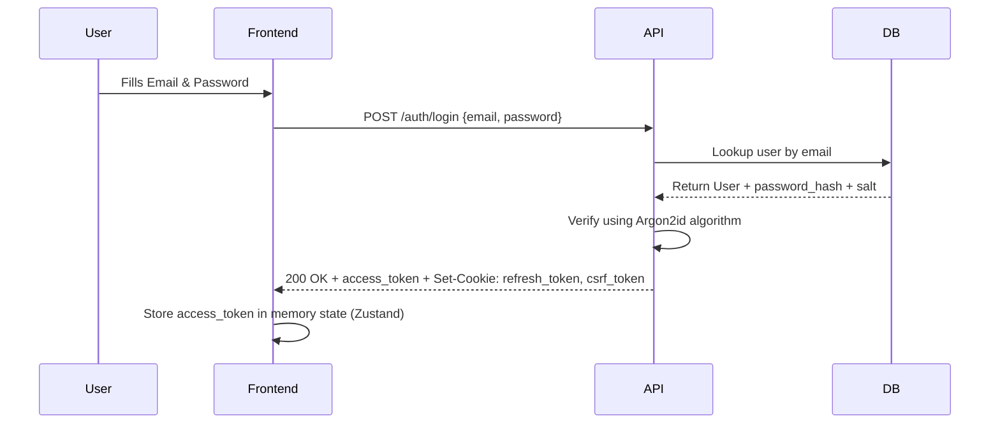

# Darkhorse Trading Platform - Technical Architecture Documentation

## 1. System Overview

Darkhorse is a robust, secure, and highly available multi-tenant web application designed for algorithmic cryptocurrency trading. The platform empowers users to write custom trading strategies using a sandboxed Python Domain Specific Language (DSL), backtest these strategies against historical OHLCV (Open, High, Low, Close, Volume) data, test them in a simulated paper trading environment, and deploy them as live automated trading bots across multiple cryptocurrency brokers (e.g., Binance, KuCoin, Coinbase).

**Main Goals & Responsibilities:**
- **Script Isolation:** Provide a mathematically safe and sandboxed execution environment for untrusted user-provided Python scripts.
- **Real-Time Responsiveness:** Maintain immediate bidirectional interaction (P&L updates, order fills, notifications) between the backend and the user interface.
- **Resilience:** Guarantee system stability even if external crypto exchanges go offline or user scripts attempt malicious/buggy operations.
- **Security:** Ensure institutional-grade encryption for highly sensitive user Broker API credentials.

**Architectural Style:**
The system is built as a **Modular Monolith** combined with a **Sidecar Sandboxing** strategy pattern. 
- It leverages a main .NET backend for API routing and client synchronization.
- It delegates heavy, long-running, and potentially unsafe tasks (strategy execution, backtesting) to a dedicated Worker process, keeping the API layer lightweight and responsive.

---

## 2. High-Level Architecture

The Darkhorse architecture cleanly separates presentation logic, API boundaries, background processing, and untrusted execution into distinct components.



### Component Breakdown
1. **Frontend (React SPA):** The user-facing interface for coding strategies, managing brokers, and monitoring live dashboards.
2. **Backend (API):** The secure HTTP and WebSocket entry point. It handles user authentication, data validation, CRUD operations, and real-time SignalR hubs.
3. **Workers (Background Services):** Driven by Hangfire and backed by PostgreSQL. The worker process schedules strategy ticks, pulls historical data from exchanges, and orchestrates the lifecycle of the Python execution containers.
4. **Isolated Docker Sandboxes:** Ephemeral, no-network, heavily resource-constrained Python containers where untrusted user code actually executes.
5. **Persistence Layer:** PostgreSQL handles relational entities and historical data, while Redis handles ultra-fast, transient lookups (like ticker prices and circuit breaker states).

---

## 3. Frontend

**Technologies:** 
- **Framework:** React 19 + TypeScript + Vite
- **Styling:** Tailwind CSS + `clsx`/`tailwind-merge` for modern, utility-first styling.
- **State Management:** Zustand (for lightweight, unopinionated global state).
- **Routing:** React Router DOM.
- **API Client:** Axios (REST) + `@microsoft/signalr` (WebSockets).
- **Editor:** Monaco Editor (`@monaco-editor/react`) for an IDE-like Python coding experience.
- **Charts:** Recharts for rendering backtest equity curves and OHLCV data.

**Application Structure:**
The frontend utilizes a componentized architecture divided into pages, features, and UI layers. 
- **Pages:** Maps to distinct app routes (e.g., `/dashboard`, `/strategies/new`).
- **Components:** Reusable elements like charts, buttons, and code editors.

**State Management Strategy:**
Zustand is used to hold the active user session and UI application state (like dark mode preference), while transient data (like lists of strategies) are often fetched and managed locally or via caching layers. 

**API Communication & Authentication:**
Axios is pre-configured with interceptors to handle the JWT lifecycle securely.
1. The client logs in and receives a short-lived `access_token` in memory, and an `HttpOnly` `refresh_token` in a cookie.
2. The Axios interceptor automatically listens for `401 Unauthorized` responses.
3. Upon a 401, Axios seamlessly calls `POST /auth/refresh` (passing the cookie automatically).
4. With the new token, Axios replays the failed request before the user even notices.

---

## 4. Backend (API)

**Technologies:** 
- **Framework:** .NET 8 LTS (ASP.NET Core)
- **Architecture Base:** Clean Architecture
- **Real-time:** SignalR
- **Validation:** FluentValidation

**Project Structure and Layering:**
The backend is strictly layered dependency-wise (Inner layers know nothing of outer layers):
- `Darkhorse.Domain`: Core Entities (`User`, `Strategy`, `Order`), Exceptions, Repository Interfaces. No underlying frameworks.
- `Darkhorse.Application`: Use Cases utilizing CQRS via MediatR. Contains DTOs, validation, and command/query handlers.
- `Darkhorse.Infrastructure`: EF Core `DbContext`, Hangfire jobs, ExchangeSharp (broker integration), Redis caches, Security services.
- `Darkhorse.Api`: The Presentation layer. Controllers, Route Definitions, SignalR Hubs, Middleware.
- `Darkhorse.Worker`: Background service entry point for Hangfire processes and Docker API integration.

**Request Lifecycle (e.g., Creating a Strategy):**
1. **Middleware:** A request enters ASP.NET Core. It passes through Rate Limiting, Authentication (JWT extraction), and CSRF validation middlewares.
2. **Controller:** Route matches `[ApiController] POST /api/strategies`. The controller binds the payload to a DTO.
3. **MediatR:** The Controller maps the request to a Command (e.g., `CreateStrategyCommand`) and delegates it to MediatR.
4. **Validation:** A FluentValidation pipeline intercepts the command. If parameters are invalid, an RFC 7807 Problem Details 400 response is immediately returned.
5. **Handler:** The `CreateStrategyCommandHandler` invokes the domain logic, interacts with `IStrategyRepository` (Infrastructure layer), and commits the entity to the PostgreSQL database.

**Error Handling Strategy:**
Global Exception Handling Middleware intercepts thrown exceptions. Domain-specific exceptions (e.g., `StrategyExecutionException`) map to HTTP 400 Bad Request, while unhandled exceptions map to HTTP 500. Structured JSON logs are simultaneously pushed to Serilog and the console for native platform log capture.

---

## 5. Workers / Background Processing

The `.NET Worker` project is a dedicated, always-on background service fueled by **Hangfire**, which allows persistent queues mapped over the existing PostgreSQL database.

**Job Processing Model:**
Workers handle three types of jobs:
- **Cron Jobs:** E.g., `DailyOhlcvExtractionJob` runs at 00:05 UTC every day to fetch the day's candles from ExchangeSharp and save them to `data_history` for fast backtesting.
- **Recurring Jobs:** E.g., `TickStrategiesJob` pulls all active strategies every minute and queues their execution.
- **Fire-and-Forget Jobs:** Async tasks like `RunBacktestJob` (triggered by user action) or sending an email notification.

**Interaction with Backend and Database:**
The Worker shares the `Application` and `Infrastructure` DLLs with the API. It reads directly from EF Core. Because Hangfire handles queue polling directly against PostgreSQL, the Worker does not require an additional message broker (like RabbitMQ or Celery/Redis).

**Strategy Container Spawning Flow:**
This ensures zero interference between untrusted code and the host server.



---

## 6. Core Architectural Patterns

### Clean Architecture
- **Concept:** Software shouldn't depend on frameworks or databases at its core.
- **Implementation:** The `Domain` layer defines interfaces like `IBrokerService`. The `Application` layer maps use cases assuming those interfaces exist. The `Infrastructure` layer actually implements `IBrokerService` using `ExchangeSharp`.
- **Why:** Allows developers to mock the database or the crypto broker entirely during unit tests without complex setup.

### CQRS (Command Query Responsibility Segregation)
- **Concept:** Splitting the logic for reading data (Queries) from the logic modifying data (Commands).
- **Implementation:** Using the `MediatR` package. Commands (`PlaceOrderCommand`) modify state, while Queries (`GetOrderHistoryQuery`) strictly read state via fast, tracking-disabled EF Core LINQ projections.
- **Why:** Keeps controllers incredibly thin, enforces single-responsibility handlers, and allows easy interception (like applying logging or validations to all Commands automatically).

### Entity Framework Core (ORM)
- **Concept:** Object-Relational Mappers map code objects directly to SQL database tables.
- **Implementation:** Code-first migrations mapped to PostgreSQL. Strategies utilize `JSONB` columns in Postgres to store dynamic user parameters seamlessly from C# `JsonElement` types. 
- **Decimal Precision:** Financial numbers (price, quantity, fees) are rigorously mapped to `NUMERIC(24, 8)` to prevent floating-point rounding errors native to crypto assets.

### Distributed Caching & Circuit Breakers
- **In-Memory (Redis):** Ticker data is retrieved from exchanges (which strictly enforce API limits) and stored in Redis with a 5-second Time-To-Live (TTL). If 1,000 bots ask for BTC/USDT price simultaneously, only 1 outward network call happens.
- **Polly Circuit Breaker:** Uses temporary local/Redis state to count consecutive errors from a broken Python script or a lagging exchange. After user-defined failures, the strategy is "Opened" (Paused) automatically to prevent account draining or API bans.

---

## 7. Data Flow

### Scenario A: User Login Flow
A secure, state-managed flow for authentication:


### Scenario B: Background Strategy Execution & Real-Time Sync
How data moves from the execution engine to the user's screen in milliseconds:
1. **Hangfire** executes the container. The script outputs `"BUY"`.
2. The **Worker** validates the output and calls `BrokerAdapter.PlaceOrderAsync()`. 
3. The Broker confirms the order. The Worker writes the new Order row to PostgreSQL.
4. The **Worker** accesses the `IHubContext<TradingHub>` injected into its service.
5. It publishes an event: `await _hubContext.Clients.User(userId).SendAsync("OnOrderFill", orderDetails)`.
6. The **API** layer routes the WebSocket message.
7. The **Frontend** React app intercepts `OnOrderFill` and updates the Dashboard table reactively.

---

## 8. Security

Security is the most critical pillar of the trading architecture, focusing on encryption, token handling, and malicious code isolation.

**1. Credential Security (AES-256-GCM):**
Exchange API secrets are **never** stored in plaintext. They are encrypted at the application layer using AES-256-GCM before hitting the database.
- A unique 96-bit nonce is generated for *every* API key.
- The `MASTER_ENCRYPTION_KEY` lives entirely in system environment variables and never enters code repositories.
- When an order needs execution, the string is pulled from DB, decrypted entirely in-memory, used, and explicitly discarded. Every decryption logs to `audit_logs` for forensic review.

**2. Attack Mitigation:**
- **CSRF (Cross-Site Request Forgery):** Uses the Double-Submit Cookie pattern. The API looks for a `X-CSRF-Token` header that matches the non-HttpOnly `csrf_token` cookie for all mutating endpoints.
- **XSS (Cross-Site Scripting):** React strictly escapes output. Strategy script DSLs are never evaluated via `eval()` on the frontend; they only render inside the Monaco Editor.
- **DDoS/Brute Force:** Handled by `AspNetCoreRateLimit`. Example: `POST /auth/login` allows 5 failures per minute per IP. `POST /auth/register` allows 3 requests per minute per IP.

---

## 9. Identity and User Management

**Dual-Token Authentication (JWT):**
- **Access Token:** Short-lived (15 minutes). Lives strictly in client memory. Attached to `Authorization: Bearer <token>` for API requests.
- **Refresh Token:** Long-lived (7 days). Stored as an `HttpOnly`, `SameSite=Lax`, `Secure` cookie. It cannot be stolen via XSS. 

**Session Management and Revocation:**
When a user explicitly clicks "Log Out" or changes their password, their active refresh token's JWT ID (`jti`) is dumped into a Redis Cache Set called `revoked:{jti}`. When the `/auth/refresh` endpoint is hit, it checks this fast Redis blacklist. If present, the refresh is denied, explicitly forcing a global session logout across all devices.

**Password Hashing:**
Passwords are mathematically hashed using **Argon2id** (via `Konscious.Security.Cryptography`), which is memory-hard and GPU-resistant, ensuring absolute safety against rainbow tables.

---

## 10. CRUD and Business Logic

**Domain Logic Separation:**
Business rules are isolated strictly within the `Application` and `Domain` layers. 
- *Rule Example:* "A strategy's `max_position_size` cannot exceed the user's current allowable limit".
- This logic does not live in an API Controller, nor does it live in the Frontend. It lives directly on the MediatR `UpdateStrategyCommandHandler` or inside the Domain Entity itself.

**Validation Strategy:**
Darkhorse strictly uses `FluentValidation`. 
```csharp
// Example Application Logic
public class CreateStrategyCommandValidator : AbstractValidator<CreateStrategyCommand>
{
    public CreateStrategyCommandValidator()
    {
        RuleFor(x => x.Timeframe).Must(t => new[] {"1m", "5m", "15m", "1h", "1d"}.Contains(t));
        RuleFor(x => x.Script).MaximumLength(10000);
    }
}
```
Validation runs automatically via the ASP.NET pipeline before the command ever touches the database, guaranteeing absolute data integrity entering PostgreSQL.

---

## 11. Performance and Scalability

**Database Optimization Strategies:**
- PostgreSQL `data_history` tables partition or utilize heavy compound indexing globally `(exchange, symbol, timeframe, ts)` to make fetching 10,000 rows for backtesting near-instant.
- Dashboard queries utilize Entity Framework's `.AsNoTracking()` to skip the overhead of keeping entities in RAM for change-tracking algorithms.

**Backtesting Efficiency:**
Instead of spawning thousands of Docker containers for a single backtest run (one for every 5-minute candle over a year), the system spawns **One** container executing a custom `backtest_runner.py` wrapper.
- The wrapper is fed the massive array of OHLCV data directly on `stdin`.
- The python wrapper natively iterates over the window entirely in isolated CPython memory, dynamically keeping a virtual portfolio.
- It calculates final metrics and returns an aggregate `pnl_percentage` and list of `trades`.
- This approach turns a 25-minute backtest logic sequence into a **sub-2 second** operation.

**Horizontal & Vertical Scaling:**
- **Vertical:** The API layer is exceptionally lightweight.
- **Horizontal:** Because all state is outsourced to PostgreSQL (Persistence) and Redis (Caching, Locks, Revocation), you can spin up exactly as many API instances or Hangfire Worker instances as needed behind a round-robin load balancer. The architecture is mathematically stateless. Distributed Locks in Redis ensure two Hangfire workers don't execute the same strategy tick simultaneously.
